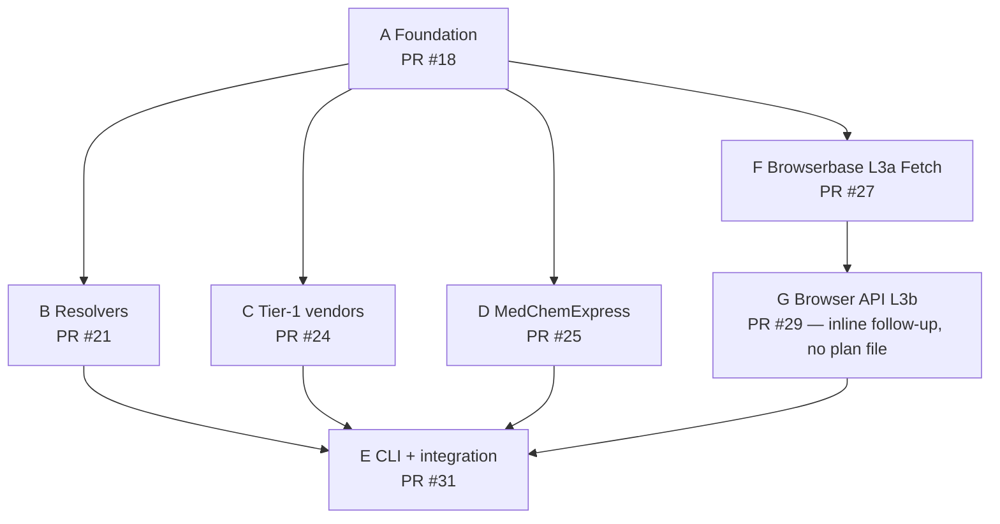

# `aichemy-pricing` — Standalone Vendor Price-Scraping Package (Master Plan)

> **For agentic workers:** REQUIRED SUB-SKILL: Use superpowers:subagent-driven-development (recommended) or superpowers:executing-plans to implement this plan task-by-task. Steps use checkbox (`- [ ]`) syntax for tracking.

## Sub-plans (each independently reviewable / executable)

This master plan is broken into 6 self-contained sub-plans (A, B, C, D, F, G feed into E). Each can be reviewed (e.g., via `/ultrareview <file>`) and executed independently of the others, subject to the listed dependencies. **All six are merged into `pricing-integration` as of 2026-04-26**; this section is now an as-shipped index.

| Sub-plan | File | Depends on | Tests (offline + live) | Merged as |
|---|---|---|---:|---|
| **A** Foundation | [`2026-04-25-aichemy-pricing-A-foundation.md`](./2026-04-25-aichemy-pricing-A-foundation.md) | — | 21 + 0 | #18 |
| **B** Offline resolvers | [`2026-04-25-aichemy-pricing-B-resolvers.md`](./2026-04-25-aichemy-pricing-B-resolvers.md) | A | 17 + 1 | #21 |
| **C** Tier 1 vendors (L2: Fluorochem, Tocris, Molbase) | [`2026-04-25-aichemy-pricing-C-tier1-vendors.md`](./2026-04-25-aichemy-pricing-C-tier1-vendors.md) | A | 15 + 3 | #24 |
| **D** Tier 3 vendor (L2: MedChemExpress only) | [`2026-04-25-aichemy-pricing-D-tier2-3-vendors.md`](./2026-04-25-aichemy-pricing-D-tier2-3-vendors.md) | A (parallel with B/C/F) | 3 + 2 | #25 |
| **F** Browserbase L3a Fetch (L3a Fetch — chemcruz only; parsers staged on disk for sigma/enamine/cayman/tocris/molbase, unregistered) | [`2026-04-25-aichemy-pricing-F-browserbase-l3.md`](./2026-04-25-aichemy-pricing-F-browserbase-l3.md) | A (parallel with B/C/D) | 23 + 1 | #27 |
| **G** Browserbase L3b Browser API (Playwright over CDP; enamine registered today) | _no standalone plan file_¹ | F | 6 + 2 | #29 |
| **E** CLI + integration | [`2026-04-25-aichemy-pricing-E-cli-integration.md`](./2026-04-25-aichemy-pricing-E-cli-integration.md) | A, B, C, D, F, G | 12 + 0 | #31 |
| **Total** | | | **97 + 9** | |

¹ Sub-Plan G was implemented inline as a follow-up to F; see PR #29. No standalone plan file exists — `browserbase/browser_api.py`, `browser_session.py`, `browser_parsers/` and the `test_browserbase_browser_*` tests are the spec.

**Recommended execution DAG (as shipped):**
- A first.
- B, C, D, F in parallel after A (they touch disjoint files).
- G after F (Browser API extends F's client + html2text plumbing).
- E last (consumes all prior).



The remainder of this document is the **architectural overview** the sub-plans reference. Implementation details live in the sub-plan files (and, for G, in the source itself).

---

**Goal:** Build `aichemy-pricing`, a standalone Python package (importable, CLI-runnable, independently testable) that resolves a chemical identifier (InChIKey / SMILES / CAS) to a per-gram USD price via a tiered chain of verified vendor sources, then plug it into the AIchemy pipeline as a thin import.

**Architecture:** Sibling package at `src/aichemy_pricing/` with its own `pyproject.toml` extras + console script + standalone pytest suite. **Three-tier lookup with a two-sublayer L3, single-chain composition:**
- **L1 (cache):** `CachedPriceLookup` over SQLite, 30-day TTL. Hits free, instant. See `chain.py`.
- **L2 (httpx):** Direct HTTPS to vendor APIs. Free, ~100 ms/lookup. Members: Fluorochem (Azure-blob JSON, no auth), Tocris + Molbase (SSR HTML), MedChemExpress (`curl_cffi` for Cloudflare). Concrete classes live under `vendors/` and are wired into `build_default_chain()` at `__init__.py:84`.
- **L3a (Browserbase Fetch API):** One POST → rendered HTML → `html2text` markdown → vendor-specific markdown parser. **SSR-only** (no JavaScript execution). $0.50–1.00 per 1K calls (Startup vs Developer plan), ~5 s/page. Today's `REGISTRY` at `browserbase/parsers/__init__.py:20` is `{"chemcruz": chemcruz}` — the only vendor whose page renders meaningful content without JS. Client at `browserbase/client.py`, lookup wrapper at `browserbase/fetch_lookup.py`. Markdown parsers for sigma/enamine/cayman/tocris/molbase exist on disk under `browserbase/parsers/` but are **unregistered** because Fetch can't render their JS — they're staged for L3b once each is calibrated.
- **L3b (Browserbase Browser API):** Playwright over CDP into a Browserbase-hosted Chrome session. `page.goto(url, wait_until="load")` + `wait_for_timeout(WAIT_AFTER_LOAD_MS)` + `page.content()` → markdown → parser. **Renders SPAs** (Enamine, Cayman, Sigma, Tocris). ~$0.0003/lookup at ~10 s wall-clock per session. Today's `REGISTRY` at `browserbase/browser_parsers/__init__.py:25` is `{"enamine": enamine}` — the only vendor empirically calibrated. Source: `browserbase/browser_api.py:28` (`BrowserbaseBrowserLookup`) + `browserbase/browser_session.py` (session lifecycle).
- **Offline-catalog resolvers** (Sub-Plan B): JOIN InChIKey → vendor SKU using PubChem FTP / ZINC tranches / Enamine BB SDFs (zero scraping). Drives the chain via `LookupByInchikey` (Sub-Plan E adapter at `lookup_by_inchikey.py`).

Every URL/schema fact is anchored to a `CLAIM-XX` verdict in `experiments/chem-pricing-verification/`.

## Browserbase economics

Numbers come from `browserbase/client.py` (Fetch pricing) and `browserbase/browser_api.py:8` (Browser API pricing).

- **L3a Fetch:** $1.00 per 1K calls on Developer, $0.50 per 1K on Startup → **$0.001 / $0.0005 per page**. Single HTTPS POST, ~5 s wall-clock, no per-session lifecycle. Suits SSR vendors only — JS-rendered SPAs return their unhydrated shell.
- **L3b Browser API:** ~$0.10/hour billed per minute → **~$0.0003 per lookup** at ~10 s wall-clock per Chrome session. Sessions close in a `finally` block (`browser_session.py`) so an exception doesn't leak billable time.
- **End-to-end estimate, 100K mixed USPTO + MetaNetX compounds:** ~50% L1+L2 hit-rate → ~50K hits to L3 → **~$25–50 of Browserbase spend** at the Developer tier (cheaper at Startup); ~30–40 min wall-clock at 100 concurrent. Cache TTL of 30 days amortizes repeat runs.

**Tech Stack:** Python 3.11+, `httpx`, `curl_cffi` (Cloudflare bypass), `polars`, `pydantic` v2, `typer` (CLI), `playwright` (L3b CDP driver), `html2text` (L3 HTML→markdown normalization), `pytest` + `pytest-httpx` (replay tests), `uv` for builds. **Browserbase Fetch + Browser APIs as L3a/L3b**; L3b uses Playwright over CDP into a Browserbase-hosted Chrome session. The LLM-extraction path remains a `NotImplementedError` stub (`browserbase/llm_extract.py:18`) — see Going-live deferrals.

**Verified facts driving this plan:** see `experiments/chem-pricing-verification/VERIFICATION.md` (29/29 claims with verdicts) and per-claim evidence in `experiments/chem-pricing-verification/evidence/CLAIM-*.md`. Verdict tally: 18 VERIFIED, 8 PARTIAL (specifics need correction), 1 FALSIFIED (Apollo — drop entirely), 2 PLAUSIBLE estimates. Apollo Scientific is **permanently excluded** from this plan because its e-commerce surface no longer exists (CLAIM-11). Sigma is **now in scope via L3b** — its markdown parser exists at `browserbase/parsers/sigma.py` but no `browser_parsers/sigma.py` is registered yet; calibration of `WAIT_AFTER_LOAD_MS` + a SPA-aware regex is the remaining work. TCI status TBD — no parser written yet, but it is in L3b scope (CLAIM-12). The original "Sigma/TCI deferred to a future Tier 4 plan" framing is obsolete.

---

## File Structure

As-shipped tree on `pricing-integration`:

```
src/aichemy_pricing/                       # sibling package, no aichemy.* imports
├── __init__.py                            # public API + build_default_chain factory
├── _version.py                            # __version__
├── types.py                               # PriceQuote, VendorRef, ResolverHit, Currency (pydantic)
├── protocol.py                            # PriceLookup, VendorResolver protocols
├── chain.py                               # ChainedPriceLookup, CachedPriceLookup (SQLite, 30d TTL)
├── ratelimit.py                           # token-bucket rate limiter
├── http.py                                # shared httpx.Client factory + curl_cffi factory
├── lookup_by_inchikey.py                  # Sub-Plan E: VendorResolver → PriceLookup adapter
├── cli.py                                 # `aichemy-price` Typer console script
│
├── resolvers/                             # Offline InChIKey → vendor-SKU JOINs (Sub-Plan B)
│   ├── __init__.py
│   ├── _sdf.py                            # extracted base SDF parser (gzip-aware)
│   ├── pubchem_sdf.py                     # parses PubChem Substance SDF FTP dump
│   ├── enamine_sdf.py                     # parses Enamine BB SDFs per functional class
│   └── zinc_tranches.py                   # parses ZINC20 2D tranche files (column-agnostic)
│
├── vendors/                               # Direct-HTTP (L2) vendor classes; all stateless
│   ├── __init__.py
│   ├── _common.py                         # extracted helpers (pack_size_to_grams, etc.)
│   ├── fluorochem.py                      # Tier 1: Azure-blob JSON pricing API
│   ├── molbase.py                         # Tier 1: /cas/{CAS}.html (CNY support)
│   ├── tocris.py                          # Tier 1: /products/{slug}_{id} (MW-strip)
│   └── medchemexpress.py                  # Tier 3: curl_cffi for Cloudflare
│   # NOTE: Enamine, Cayman, ChemCruz, Sigma never got standalone L2 vendor
│   # classes — they live in browserbase/parsers/ and browserbase/browser_parsers/.
│
└── browserbase/                           # L3a Fetch + L3b Browser API (Sub-Plans F + G)
    ├── __init__.py                        # re-exports BrowserbaseFetchLookup, BrowserbaseBrowserLookup
    ├── client.py                          # L3a: Fetch API HTTPS POST + html2text
    ├── fetch_lookup.py                    # L3a: PriceLookup wrapper around the client
    ├── browser_api.py                     # L3b: BrowserbaseBrowserLookup (Playwright over CDP)
    ├── browser_session.py                 # L3b: session lifecycle (open/close in finally)
    ├── llm_extract.py                     # STUB: NotImplementedError (future revision)
    ├── parsers/                           # L3a markdown parsers; REGISTRY = {"chemcruz": …}
    │   ├── __init__.py                    # only chemcruz registered (others fail SSR)
    │   ├── _base.py
    │   ├── chemcruz.py                    # registered — SSR HTML
    │   ├── sigma.py                       # written; unregistered (Akamai blocks Fetch)
    │   ├── enamine.py                     # written; unregistered (SPA needs L3b)
    │   ├── cayman.py                      # written; unregistered (SPA needs L3b)
    │   ├── tocris.py                      # written; unregistered (Akamai)
    │   └── molbase.py                     # written; unregistered (>10s timeout)
    └── browser_parsers/                   # L3b parsers; REGISTRY = {"enamine": …}
        ├── __init__.py                    # only enamine empirically calibrated today
        └── enamine.py                     # URL_TEMPLATE + WAIT_AFTER_LOAD_MS + parse()

src/aichemy_pricing/tests/                 # 27 test files; standalone, runs without aichemy
├── __init__.py
├── conftest.py
├── data/_capture.py                       # live-capture helper for replay fixtures
├── test_types.py                          # Sub-Plan A: 7
├── test_chain.py                          # Sub-Plan A: 4
├── test_cache.py                          # Sub-Plan A: 4
├── test_ratelimit.py                      # Sub-Plan A: 3
├── test_http.py                           # Sub-Plan A: 3
├── test_sdf_parser.py                     # Sub-Plan B: 4
├── test_resolvers_pubchem.py              # Sub-Plan B: 5
├── test_resolvers_enamine.py              # Sub-Plan B: 3
├── test_resolvers_zinc.py                 # Sub-Plan B: 6 (1 live)
├── test_vendors_fluorochem.py             # Sub-Plan C: 6 (1 live)
├── test_vendors_molbase.py                # Sub-Plan C: 6 (1 live)
├── test_vendors_tocris.py                 # Sub-Plan C: 6 (1 live)
├── test_vendors_medchemexpress.py         # Sub-Plan D: 5 (2 live)
├── test_browserbase_client.py             # Sub-Plan F: 6 (1 live)
├── test_browserbase_fetch_lookup.py       # Sub-Plan F: 4
├── test_browserbase_parser_chemcruz.py    # Sub-Plan F: 2
├── test_browserbase_parser_sigma.py       # Sub-Plan F: 2
├── test_browserbase_parser_enamine.py     # Sub-Plan F: 2
├── test_browserbase_parser_cayman.py      # Sub-Plan F: 2
├── test_browserbase_parser_tocris.py      # Sub-Plan F: 2
├── test_browserbase_parser_molbase.py     # Sub-Plan F: 3
├── test_browserbase_stubs.py              # Sub-Plan F: 1 (LLM stub raises)
├── test_browserbase_browser_lookup.py     # Sub-Plan G: 6 (2 live)
├── test_browserbase_browser_parser_enamine.py  # Sub-Plan G: 2
├── test_cli.py                            # Sub-Plan E: 6
├── test_lookup_by_inchikey.py             # Sub-Plan E: 3
└── test_build_default_chain.py            # Sub-Plan E: 3

pyproject.toml                             # `pricing` extra + entry point
src/aichemy/preprocessing/augment/prices.py  # consumes `from aichemy_pricing import build_default_chain`
```

**Key boundary:** `aichemy_pricing` does **not** import anything from `aichemy.*`. The reverse arrow (aichemy → aichemy_pricing) is fine and is the only integration point. This means `pytest src/aichemy_pricing/tests/` runs without the rest of the project.

---

## Implementation phases — see sub-plans for full TDD task lists

Phase content has been moved to the dedicated sub-plan files (see Sub-plans table at top). The master plan keeps only the architectural overview to avoid drift between two copies of the same task list. Each sub-plan is fully self-contained.

| Phase | Sub-plan | Summary |
|---|---|---|
| 0 — Package scaffolding | A | Add `pricing` extra + console script; create package skeleton + test harness; extend hatch/mypy/pytest scopes (Revision 24) |
| 1 — Core types/chain/cache | A | `types.py`, `protocol.py`, `ratelimit.py`, `chain.py` (with R17 try/except guard), `http.py`; SQLite-backed quote cache |
| 2 — Offline catalog resolvers | B | PubChem SDF (gzip-aware per R22), Enamine BB SDF, ZINC tranche resolvers (column-agnostic per R5); shared `_sdf.py` base |
| 3 — Tier 1 L2 vendors (plain HTTP) | C | Fluorochem (Azure-blob JSON), Molbase (CNY support per R3), Tocris (MW-strip per R18); shared `_common.py` helpers |
| 4 — Tier 3 L2 vendor (Cloudflare) | D | **MedChemExpress only** (`curl_cffi`). Enamine, Cayman, ChemCruz, and Sigma never got standalone L2 vendor classes — they live in `browserbase/parsers/` (L3a) and `browserbase/browser_parsers/` (L3b) exclusively. |
| 5a — L3a Browserbase Fetch fallback | F | One-POST `BrowserbaseClient` + `BrowserbaseFetchLookup`; markdown parsers under `browserbase/parsers/` for sigma/enamine/cayman/chemcruz/tocris/molbase; only chemcruz registered (others fail SSR). LLM-extract path stubbed with `NotImplementedError`. |
| 5b — L3b Browserbase Browser API | G | `BrowserbaseBrowserLookup` (Playwright over CDP into a Browserbase-hosted Chrome session) + `browser_session` lifecycle helper; `browser_parsers/` registry currently `{enamine}` only. Inline follow-up to F (PR #29); no standalone plan file. |
| 6 — CLI | E | `aichemy-price` Typer app with `lookup`, `chain`, `resolve` |
| 7 — Public API + AIchemy integration | E | `__init__.py` re-exports; `build_default_chain()` factory wires L1+L2+L3a+L3b; `PricesConfig` schema update (R23); `LookupByInchikey` adapter (Sub-Plan E) with FX-staleness warning (R28); `make_lookup` branch |
| 8 — End-to-end verification | E | Standalone test suite (97 offline + 9 live), AIchemy regression, README, run on 100K-compound subset |

## Going-live deferrals

Items deliberately not active in `pricing-integration` today, with the work needed before they go live:

- **Sigma-Aldrich.** Akamai-gated (CLAIM-13). **Now in L3b scope** — Browserbase's stealth + residential IPs + JS-rendered Browser API handle Akamai. Parser at `browserbase/parsers/sigma.py` is written but not registered for Fetch (Akamai blocks JS-less requests); registration in the L3b `browser_parsers/` REGISTRY is pending one round of empirical calibration of `WAIT_AFTER_LOAD_MS` + a SPA-aware regex. Then add a `browser_parsers/sigma.py` mirroring `enamine.py`.
- **TCI Chemicals.** Akamai-gated (CLAIM-12). **In L3b scope, status TBD** — no parser written yet. Same calibration loop as Sigma once the URL template + a known-good SKU are in hand.
- **Apollo Scientific.** FALSIFIED (CLAIM-11) — store decommissioned. **Permanently excluded.** Do not revisit.
- **BLDpharm.** URL pattern in original report is wrong (CLAIM-16); real pattern not yet discovered. Deferred pending URL discovery; not worth pursuing until a working URL example is sourced.
- **LLM extraction (`browserbase/llm_extract.py:18`).** `BrowserbaseLLMLookup.__init__` raises `NotImplementedError`. Reserved for a future revision because a paid LLM call costs more than a per-vendor regex parser; build this only when the parser-per-vendor cost grows past the LLM-call cost (~50+ vendors). The error message itself states this rationale and is exercised by `test_browserbase_stubs.py`.
- **Avanti SAP migration (June 2026).** Per CLAIM-21, MilliporeSigma will change Avanti SKU codes in June 2026. Cache TTL of 30 days mitigates this; full re-resolution recommended after the migration window.
- **CLAIM-04 PARTIAL → resolved.** The original `PubChemSdfResolver` keyed on `PUBCHEM_IUPAC_INCHIKEY` from the Substance dump. Empirical finding: vendor-deposited Substance records do **not** carry that field — the InChIKey is computed by PubChem's standardization pipeline and only stored on the linked Compound (CID) record. The fix: `PubChemCompoundResolver` (`src/aichemy_pricing/resolvers/pubchem_compound.py`) does the canonical 3-way JOIN — Substance (vendor + SKU + SID) ↔ `SID-Map.gz` (SID → CID) ↔ Compound (CID → InChIKey) — and persists the result to `data/interim/aichemy_pricing_index.parquet` so subsequent runs deserialize in ~5 sec instead of rebuilding for ~30–60 min. The `PubChemSdfResolver` is kept exported for the rare data sources that *do* deposit InChIKey on the Substance record. See `docs/superpowers/plans/2026-04-26-pricing-scalability.md` for the full discovery process.

---

## Self-review

**As-shipped status:** All six sub-plans (A, B, C, D, F, G) are merged into `pricing-integration` (PRs #18, #21, #24, #25, #27, #29); E lands the CLI + AIchemy integration on top (PR #31). Test suite is 97 offline + 9 live = 106 tests across 27 files. The architectural pivot since the original plan: L3 split into L3a (Fetch, SSR-only) and L3b (Browser API, JS-rendered SPAs); Sigma and TCI moved out of "Tier-4 deferred" and into the L3b roadmap; Apollo permanently excluded.

**Spec coverage check:** Every verdict in `experiments/chem-pricing-verification/CLAIMS.md` is reflected: VERIFIED claims drove implementation; PARTIAL claims drove implementation with corrected URLs/schemas; FALSIFIED (Apollo) is permanently excluded; quantitative estimates inform the Browserbase-economics section above. Sigma/TCI are in L3b scope (Sigma parser written, calibration pending; TCI status TBD); BLDpharm is deferred pending URL discovery.

**Type consistency:** `VendorRef`, `ResolverHit`, `PriceQuote` are used consistently across all vendor modules, resolvers, and L3 parsers. The `lookup(ref: VendorRef) -> PriceQuote | None` signature is the single mental model — `BrowserbaseFetchLookup`, `BrowserbaseBrowserLookup`, and the L2 vendor classes all conform to it.
